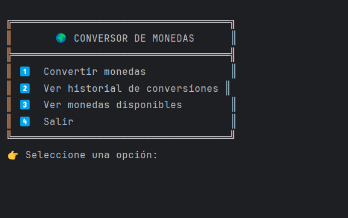
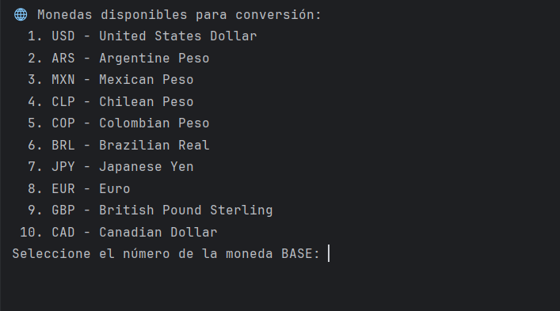
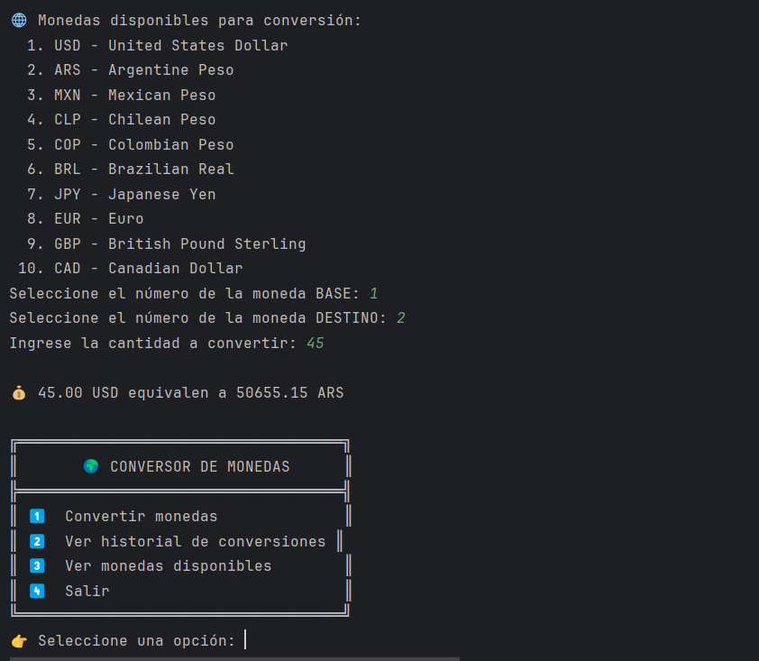

# 💱 Conversor de Monedas - Alura Challenge

Este es un conversor de monedas desarrollado en Java como parte del programa **Oracle Next Education (ONE) - Alura Latam**.

El programa permite al usuario convertir entre distintas monedas utilizando la API de ExchangeRate y ofrece funcionalidades adicionales como historial de conversiones y listado de monedas disponibles.

---

## 🧠 Funcionalidades

- Conversión entre diferentes monedas (USD, ARS, EUR, etc.)
- Consulta de las monedas disponibles para conversión
- Historial detallado de conversiones realizadas
- Interfaz de texto amigable para el usuario
- Manejo de errores y validación de entrada

---

## 🔧 Tecnologías utilizadas

- Java 22
- API pública de [ExchangeRate-API](https://www.exchangerate-api.com/)
- Gson (para manejo de JSON)
- `HttpClient` (para peticiones HTTP)

---

## 🚀 Cómo ejecutar el proyecto

### 1. Clona el repositorio

```bash
git clone https://github.com/tu-usuario/conversor-monedas.git
cd conversor-monedas
```

### 2. Asegurate de tener Java instalado

```bash
java --version
```

### 3. Configura tu archivo `config.properties`

En el directorio raíz, crea un archivo llamado `config.properties` con el siguiente contenido:

```
apikey=TU_API_KEY
```

> ⚠️ Reemplaza `TU_API_KEY` por tu propia clave de ExchangeRate-API. Hecho de esta manera para mantener la seguridad y privacidad de su API Key personal.

### 4. Compila y ejecuta el programa

```bash
javac -d out src/miguel/alura/com/conversor/*.java
java -cp out miguel.alura.com.conversor.Principal
```

---

## 🖼️ Ejemplo de uso
1.- Seleccionamos una de las opciones disponibles. En este caso, convertir monedas.



2.- Seleccionamos la moneda base a convertir y su moneda destino. (Por ejemplo de USD a ARS).



3.-Una vez realizado el paso anterior, la aplicación conectará con la API y realizará la conversión, mostrándola en pantalla.



---

## 📁 Estructura del proyecto

```
src/
├── user/alura/com/conversor/
│   ├── Principal.java
│   ├── ApiService.java
│   ├── TasaDeCambio.java
│   └── ConfigLoader.java
│   └── CurrencyLoader.java
```

---

## 🧑 Autor

**Miguel**  
Desarrollador Java en formación - Programa Oracle ONE  
📧 miguelg1920@hotmail.com

---

## 📄 Licencia

Este proyecto es parte del programa educativo ONE - Oracle Next Education, con fines de aprendizaje.
